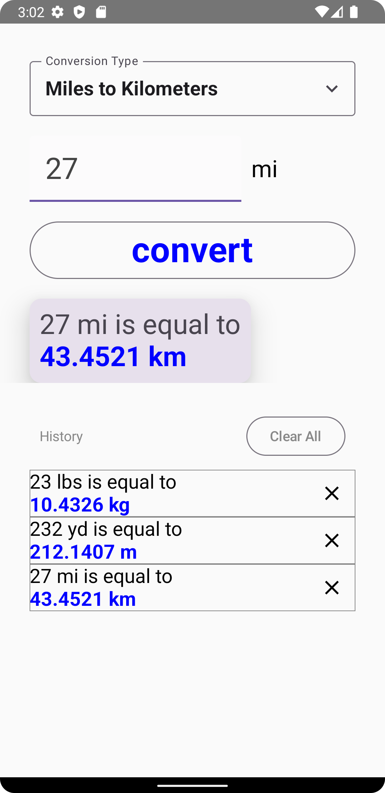
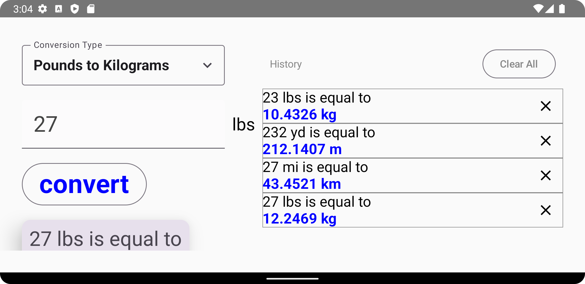

# Unit Converter Application

A user-friendly **Unit Converter** app built using **Jetpack Compose**. This application enables users to perform unit conversions seamlessly with a simple and interactive interface. The app is optimized for both **portrait** and **landscape** orientations, ensuring a great user experience across all device configurations.

---

## 📑 Features

- **Dynamic Conversion Menu**: Select conversion types from a dropdown menu.
- **Real-time Calculation**: View results instantly after entering values.
- **Landscape and Portrait Modes**: Adaptive UI for better usability.
- **History Section**: Keep track of recent conversions and manage history.
  - Removes individual entries.
  - Clears all history with a single action.

---

## 📷 Screenshots

### Portrait Mode

### Landscape Mode

---

## 🛠️ Technologies Used

- **Kotlin**: The main programming language.
- **Jetpack Compose**: For building declarative UIs.
- **Material Design 3**: Ensuring a modern look and feel.
